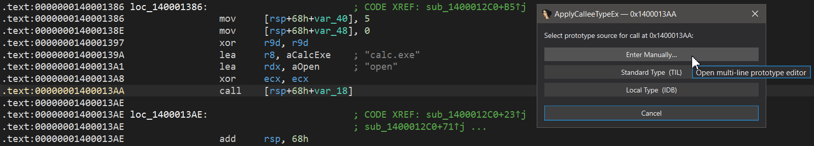
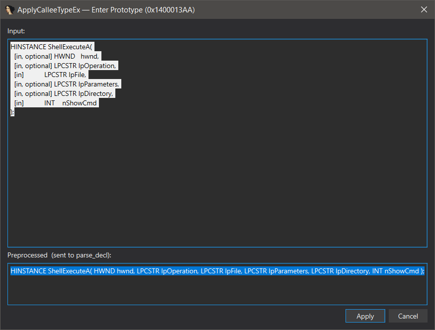
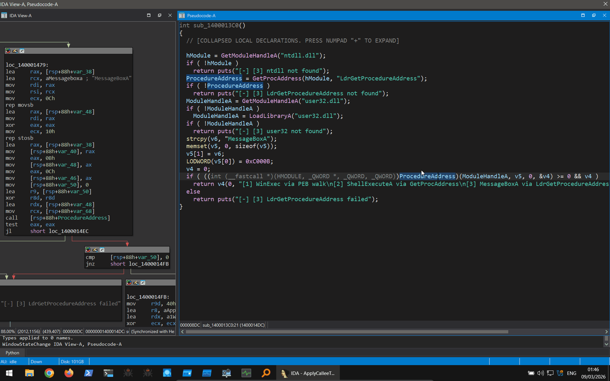

# ApplyCalleeTypeEx

> **ApplyCalleeType — Reborn for IDA Pro 9.3** *(compatible IDA Pro 8.x → 9.3+)*

[](https://www.python.org/)
[](https://hex-rays.com/ida-pro/)
[](LICENSE)

A single-file IDA Pro plugin that applies a known function prototype to an indirect `CALL` instruction — unlocking correct decompiler **and disassembler** output for runtime-resolved APIs with no named global involved.

---

## A Note of Appreciation

The original [Mandiant FLARE `apply_callee_type`](https://github.com/mandiant/flare-ida/blob/master/plugins/apply_callee_type_plugin.py) plugin is, in my opinion, one of the most practically useful IDA plugins ever written. For anyone doing daily malware analysis or vulnerability research, indirect calls with unknown prototypes are a constant friction point — and the FLARE team's plugin removes that friction with a single keypress. The elegance of wrapping `apply_callee_tinfo()` in a clean workflow is something I have used and appreciated for years.

When IDA 9.x landed with breaking API changes, the original plugin stopped loading entirely. Because I rely on it so heavily, and because many in the community were still running IDA 8.x, I decided to fully port and modernise it — preserving 100% of the original functionality, fixing every broken API, and adding the features I always wished it had. The result is a single drop-in file with no dependencies, compatible from IDA 8.x through 9.3+.

Full credit and deep respect to the Mandiant FLARE team for the original idea and implementation.

---

## Background

When reversing binaries that resolve API addresses at runtime — for example via PEB walk, `GetProcAddress`, `LdrGetProcedureAddress`, custom hash-based resolution, or any other technique — the resolved pointer is typically stored in a **local stack variable**, not a named global. IDA has no symbol to anchor type information to, so the decompiler and disassembler render the call with completely wrong or missing argument types:

**Before — Disassembly:**
```asm
mov     [rsp+68h+var_40], 5
mov     [rsp+68h+var_48], 0
xor     r9d, r9d
lea     r8, aCalcExe    ; "calc.exe"
lea     rdx, aOpen      ; "open"
xor     ecx, ecx
call    [rsp+68h+var_18]
```

**Before — Pseudocode:**
```c
v5(0, "open", "calc.exe", 0, 0, 5);
// Type: int (__fastcall *v5)(_QWORD, const char *, const char *, _QWORD, _QWORD, int)
```

Place the cursor anywhere on the `CALL` line in the disassembly view, or on the pointer variable (e.g. `v5`) or the call expression `(` in the pseudocode view — any of these work. Apply the known prototype and IDA's `apply_callee_tinfo()` propagates argument types, names, and stack layout immediately:

**After — Disassembly:**
```asm
mov     [rsp+68h+nShowCmd], 5 ; nShowCmd
mov     [rsp+68h+lpDirectory], 0 ; lpDirectory
xor     r9d, r9d        ; lpParameters
lea     r8, File        ; "calc.exe"
lea     rdx, Operation  ; "open"
xor     ecx, ecx        ; hwnd
call    [rsp+68h+ShellExecuteA]
```

**After — Pseudocode:**
```c
ShellExecuteA(0, "open", "calc.exe", 0, 0, SW_SHOW);
// Type: void (__stdcall *ShellExecuteA)(HWND hwnd, LPCSTR lpOperation, LPCSTR lpFile, LPCSTR lpParameters, LPCSTR lpDirectory, INT nShowCmd)
```

The key reason a plugin is necessary: if the function pointer were stored in a **named global**, a simple rename in IDA would propagate the type automatically — no plugin needed. With a **local stack variable**, IDA has no anchor, and `apply_callee_tinfo()` is the only correct fix.

> Reference: [Function Prototypes and Indirect Calls — Mandiant FLARE blog](https://cloud.google.com/blog/topics/threat-intelligence/function-prototypes-indirect-calls/)

---

## What's Different from the Original

The original FLARE plugin was a functional but minimal proof of concept. This port goes significantly further:

| Feature | Original FLARE | ApplyCalleeTypeEx |
|---|---|---|
| IDA 9.x compatibility | ❌ Crashes on load (removed APIs) | ✅ Full support |
| IDA 8.x compatibility | ✅ Yes | ✅ Yes — backward compatible |
| Package dependency | ❌ Requires `flare` package installed | ✅ Single file, zero dependencies |
| Legacy API shims | ❌ IDA 6.x / 7.x / 8.x version branching | ✅ Removed entirely |
| Right-click context menu | ❌ Not present | ✅ Disassembly + Pseudocode views |
| Pseudocode cursor support | ❌ Not present | ✅ Variable ref, call expression, or call line |
| Prototype editor | ❌ Single-line plain text input | ✅ Multi-line editor with live preprocessing preview |
| Preprocessing | ❌ Strips 3 basic MSDN macros | ✅ Full SAL, ntdoc, Windows SDK headers, `__declspec`, `extern "C"`, CC macros |
| `VOID` macro handling | ❌ Not handled | ✅ Normalised to `void` before parsing |
| Parse failure feedback | ❌ Silent | ✅ Reports to IDA output window |
| Hotkey | ❌ `Alt+J` — conflicts with IDA internals | ✅ `Shift+A` — conflict-free on 8.x and 9.x |
| Test suite | ❌ None | ✅ 210 checks, verified on IDA 8.4 and 9.3 |

---

## Screenshots

<br>


*Type source selection dialog — three input paths with tooltips*

<br>


*Multi-line prototype editor with live preprocessing preview — paste any real-world prototype format directly*

<br>


*Applying `LdrGetProcedureAddress` prototype to a runtime-resolved indirect call — disassembler and decompiler update immediately*

---

## Installation

Copy the plugin file to your IDA plugins directory. Two locations are supported:

**Per-user — recommended, survives IDA reinstalls:**
```
%APPDATA%\Hex-Rays\IDA Pro\plugins\apply_callee_type_ex.py
```

**System-wide:**
```
%IDADIR%\plugins\apply_callee_type_ex.py
```

Restart IDA to activate the plugin. On first load the output window confirms:

```
[ApplyCalleeTypeEx] Ready  |  Shift+A  |  right-click: disasm + pseudocode  |  Qt: pyside6
```

### IDA Plugin Manager (HCLI)

The plugin supports the [IDA Plugin Manager](https://hcli.docs.hex-rays.com/user-guide/plugin-manager/) via `ida-plugin.json` included in this repository. Once the plugin is published to [plugins.hex-rays.com](https://plugins.hex-rays.com/), it can be installed with:

```
hcli plugin install ApplyCalleeTypeEx
```

---

## Usage

1. Load any binary in IDA Pro 8.x or 9.3+
2. Navigate to an indirect `CALL` instruction — `call rax`, `call [rsp+var_18]`, etc.
3. Trigger the plugin via any of three entry points:
   - **`Shift+A`** hotkey
   - **Edit → Operand type → ApplyCalleeTypeEx**
   - **Right-click** in the disassembly or pseudocode view
4. Select a prototype source:
   - **Enter Manually…** — paste any real-world prototype; MSDN brackets, SAL annotations, `__declspec`, `extern "C"`, and Windows API macros are stripped automatically
   - **Standard Type (TIL)** — browse loaded type library types (Windows SDK, POSIX, ntdll, etc.)
   - **Local Type (IDB)** — browse types defined in the current IDB
5. The prototype is applied; both the disassembly and decompiler views refresh immediately

**Cursor placement** — all of the following work:
- Anywhere on the `CALL` instruction line in the disassembly view
- On the pointer variable (e.g. `v5`) in the pseudocode view
- On the call expression `(` in the pseudocode view

---

## Supported Prototype Formats

The manual entry path accepts prototypes copied directly from any common source without editing:

```c
// Plain C
UINT WinExec(LPCSTR lpCmdLine, UINT uCmdShow);

// Windows SDK header (MSDN / WINBASEAPI / SAL)
WINBASEAPI
UINT
WINAPI
WinExec(
    _In_ LPCSTR lpCmdLine,
    _In_ UINT uCmdShow
    );

// ntdoc / ntdll (NTSYSAPI / NTAPI / SAL)
NTSYSAPI
NTSTATUS
NTAPI
LdrGetProcedureAddress(
    _In_     PVOID          DllHandle,
    _In_opt_ PCANSI_STRING  ProcedureName,
    _In_opt_ ULONG          ProcedureNumber,
    _Out_    PVOID         *ProcedureAddress
);

// typedef funcptr
typedef UINT (WINAPI *PWINEXEC)(LPCSTR lpCmdLine, UINT uCmdShow);

// Bare funcptr
UINT (__stdcall *)(LPCSTR, UINT)
```

---

## Test Suite

A comprehensive test script is provided in `Tests/test_apply_callee_type_ex.py`. It runs entirely inside IDA via **File → Script file…** and validates the full plugin API surface without requiring a specific binary.

```
IDA Pro 8.4 (x86 / x64):   210 passed, 0 failed
IDA Pro 9.3 (x86 / x64):   210 passed, 0 failed
```

| Section | What is tested |
|---|---|
| A | Preprocessor — all 30 strip/map rules |
| B | `parse_type_from_string` — 38 prototype formats + failure cases |
| C | TIL named type retrieval |
| D | `_resolve_to_func_type` — func / funcptr / typedef / scalar |
| E | `apply_type_to_call` — live binary + rejection cases |
| F | Automatic func → funcptr conversion |
| G | Full API surface parity + forbidden API scan |
| H | Preprocessor edge cases |
| I | Parse round-trip fidelity |
| Z | Diagnostics (Qt layer, TIL name, flag values) |

---

## PoC Test Binary

`Tests/ApplyCalleeTypeEx_Test_VS/` contains a Visual Studio solution demonstrating three runtime API resolution techniques that produce indirect call sites with unknown prototypes — exactly the scenario this plugin is designed for.

Each technique stores the resolved function address in a **local stack variable**, not a named global. This is intentional: if a named global were used, a simple rename in IDA would suffice. With a local variable, `apply_callee_tinfo()` is the only correct fix.

### Resolution Techniques

| Function | Resolution Method | Target API | Prototype to Apply |
|---|---|---|---|
| `technique_peb_winexec()` | PEB walk + export directory parsing | `WinExec` | `UINT WinExec(LPCSTR lpCmdLine, UINT uCmdShow)` |
| `technique_getprocaddress_shellexecute()` | `GetProcAddress` via opaque local pointer | `ShellExecuteA` | `HINSTANCE ShellExecuteA(HWND, LPCSTR, LPCSTR, LPCSTR, LPCSTR, INT)` |
| `technique_ldr_messagebox()` | `ntdll!LdrGetProcedureAddress` (not in IAT) | `MessageBoxA` | `int MessageBoxA(HWND, LPCSTR, LPCSTR, UINT)` |

### Build

Open `ApplyCalleeTypeEx_Test_VS.sln` in Visual Studio and build **Release | x86** or **Release | x64**.

Required settings (differ from VS defaults):

| Setting | Path | Value |
|---|---|---|
| Optimization | C/C++ → Optimization | **Disabled (/Od)** |
| Inline expansion | C/C++ → Optimization → Inline Function Expansion | **Disabled (/Ob0)** |
| Debug info | C/C++ → General → Debug Information Format | **Program Database (/Zi)** |

Pre-built binaries are included in `Tests/ApplyCalleeTypeEx_Test_VS/Release/` (x86) and `Tests/ApplyCalleeTypeEx_Test_VS/x64/Release/` (x64).

---

## Repository Structure

```
ApplyCalleeTypeEx/
│   apply_callee_type_ex.py              ← plugin (drop into IDA plugins directory)
│   ida-plugin.json                      ← IDA Plugin Manager metadata
│   LICENSE
│   README.md
│
├───Media
│       image1.png                       ← type source dialog screenshot
│       image2.png                       ← manual prototype editor screenshot
│       image3.gif                       ← demo — applying LdrGetProcedureAddress in pseudocode
│
└───Tests
    │   test_apply_callee_type_ex.py     ← test suite (run via File → Script file…)
    │
    └───ApplyCalleeTypeEx_Test_VS
        │   ApplyCalleeTypeEx_Test_VS.sln
        │
        ├───ApplyCalleeTypeEx_Test_VS
        │       ApplyCalleeTypeEx_Test_VS.cpp
        │       ApplyCalleeTypeEx_Test_VS.vcxproj
        │       ApplyCalleeTypeEx_Test_VS.vcxproj.filters
        │       ApplyCalleeTypeEx_Test_VS.vcxproj.user
        │
        ├───Release
        │       ApplyCalleeTypeEx_Test_VS.exe    ← x86 pre-built
        │
        └───x64
            └───Release
                    ApplyCalleeTypeEx_Test_VS.exe  ← x64 pre-built
```

---

## License

Licensed under the **Apache License 2.0** — see the [LICENSE](LICENSE) file for the full text.

This project is a derivative work of the original [Mandiant FLARE apply_callee_type plugin](https://github.com/mandiant/flare-ida/blob/master/plugins/apply_callee_type_plugin.py).  
Original license: [Apache License 2.0](https://github.com/mandiant/flare-ida/blob/master/LICENSE) — Copyright (C) 2019 Mandiant, Inc. All Rights Reserved.

If you fork or further modify this project, you must retain:
- The original Mandiant copyright notice
- Attribution to this port: **Jiří Vinopal (Dump-GUY)**

---

## Credits

**Original plugin:** [Mandiant FLARE team](https://github.com/mandiant/flare-ida)  
**IDA 9.3 port & enhancements:** Jiří Vinopal  
&nbsp;&nbsp;&nbsp;&nbsp;X / Twitter: [@vinopaljiri](https://x.com/vinopaljiri)  
&nbsp;&nbsp;&nbsp;&nbsp;GitHub: [Dump-GUY](https://github.com/Dump-GUY)
